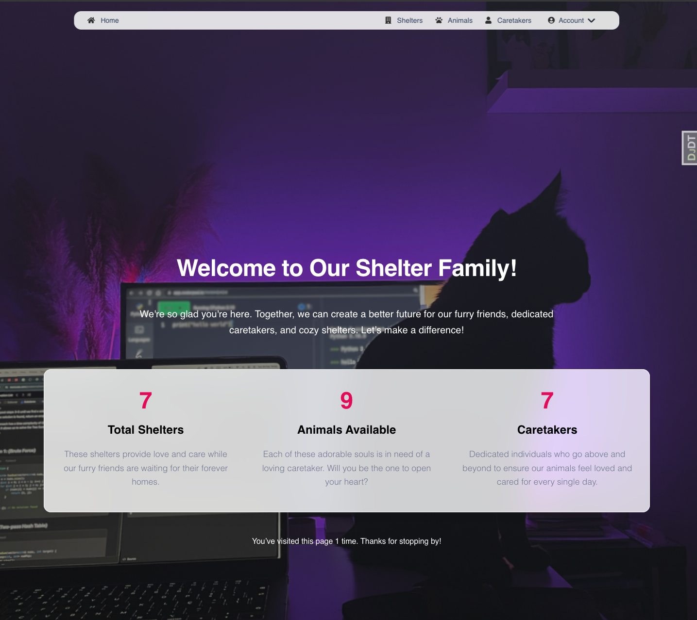

# Animal Shelter Management System

## Description

A Django-based application that streamlines animal shelter management, allowing users to track animals, caretakers, and shelter details efficiently. The system is designed to help shelters keep their operations organized with features for managing shelters, assigning caretakers, and logging animal information.

---

## Features

- Manage shelters and track their capacity and contact information.
- Assign caretakers to animals and track their experience and roles.
- Log animals' information, including species, status (adopted or not), and shelter association.
- Secure login and role-based user access.
- Responsive design using Material Kit 2 and Bootstrap 5.

---

## Installation

To set up this project, you need to have Python3 already installed. Then, run these commands:

```bash
# Clone the repository
git clone https://github.com/your-username/animal-shelter-management-system.git
cd animal-shelter-management-system

# Create a virtual environment
python -m venv venv

# Activate the virtual environment
venv\Scripts\activate # On Windows
source venv/bin/activate # On macOS/Linux

# Install dependencies
pip install -r requirements.txt

# Set up the database
python manage.py migrate

# Run the Django development server
python manage.py runserver
```

---

## Usage


The project will be deployed soon on [Render](https://render.com).  
Stay tuned for the deployment link and login credentials.  


---

# Technologies Used  

- Django  
- Python
- PostgreSQL
- Material Kit 2
- Bootstrap 5

---

# Demo  


